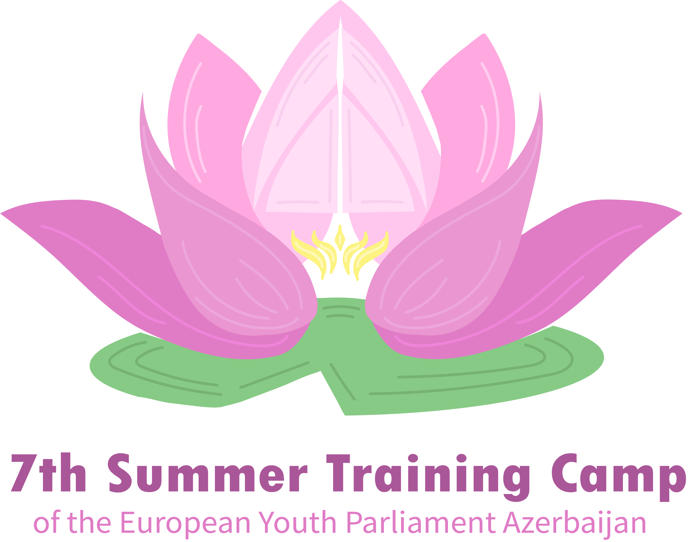

# EYP Summer Training Camp Website

[](LICENSE)


> Your digital gateway to the 7th annual European Youth Parliament Summer Training Camp in beautiful Baku, Azerbaijan.

---

## ✨ Preview


---

## 🚀 Features

- **Landing Page** with vibrant hero image & “Apply Now” button
- **About** section: mission, EYP history, and why Azerbaijan
- **Program & Schedule**: daily timetable, workshops, keynote sessions
- **Speakers**: meet our facilitators
- **FAQ**: visa info, language tips, dress code, packing list

---

## 🗺️ Roadmap

- [x] **Gallery**: snapshots, videos from past camps
- [ ] **Venue & Logistics**: maps, travel tips, accommodations
- [ ] **Registration**: online application, deadlines, payment
- [ ] **News & Blog**: updates, stories, highlights

> Want to help? See [open issues](https://github.com/Ph4ntomByte/Summer_Training_Camp/issues) or suggest a feature!

---

## 🛠️ Getting Started

### Prerequisites
- Node.js >= 18.x
- npm >= 9.x

### Installation

```bash
git clone https://github.com/Ph4ntomByte/Summer_Training_Camp.git
cd Summer_Training_Camp
npm install
```

### Development

```bash
npm run dev
```
Open [http://localhost:3000](http://localhost:3000) in your browser.

### Production

```bash
npm run build
npm start
```

---

## 🌎 Deployment

Describe where and how to deploy the site (e.g., Vercel, Netlify, Docker, etc.)

---

## 🤝 Contributing

We welcome your input! To contribute:
1. Fork the repo
2. Create a feature branch
3. Make your changes (please write clear commit messages)
4. Open a pull request

See [CONTRIBUTING.md](CONTRIBUTING.md) for more details.

---

## 💬 Community & Support

- For questions and support, create a [Discussion](https://github.com/Ph4ntomByte/Summer_Training_Camp/discussions) or open an [Issue](https://github.com/Ph4ntomByte/Summer_Training_Camp/issues).

---

## 📄 License

This project is released under the [MIT License](LICENSE).